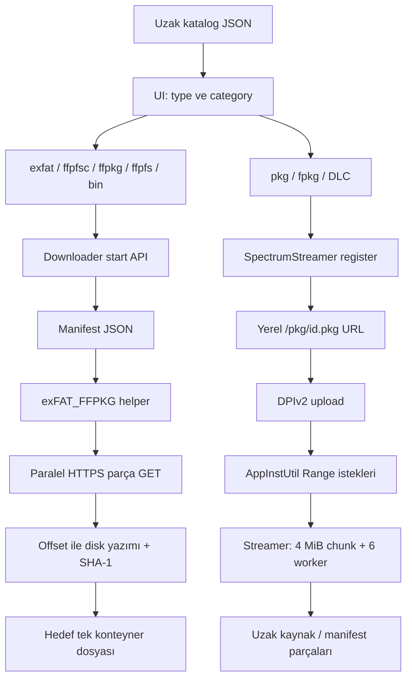

# Spectrum Library 1.4.8 — Baştan sona indirme akışı

**Tarih:** 2026-10-02. **İncelenen dosya:** `SpectrumLibrary_1.4.8.elf`, SHA-256 `5D1372D48F76167E3F9E24B335CF571EA6E4B3960E6B7202D2802B0F78C3A519`.

**Temel sonuç:** `.exfat`, `.ffpfsc`, `.ffpkg` ve `.ffpfs` oyunları, önceden hazırlanmış konteyner dosyalarının manifestle tarif edilen parçaları indirilerek oluşturuluyor. Downloader bu formatları üretmiyor veya içlerindeki oyun dosyalarını çıkarmıyor. Katalogdaki `type` hedef uzantıyı seçiyor; parça verileri `fileOffset` konumuna yazılıyor. `.pkg`/`fpkg` ve DLC için arayüz ayrı **SpectrumStreamer → DPIv2 → AppInstUtil** kurulum yolunu seçiyor.

## 1. Kanıtın kapsamı

Bu rapor üç tür kanıtı ayırır:

| Kanıt | Yapılan işlem | İspat ettiği |
|---|---|---|
| Statik kod | Ana ELF ve gömülü helper'ların IDA/Hex-Rays incelemesi | Hangi fonksiyonun hangi seçeneği/alanı kullandığı |
| Gerçek servis JSON'u | Önceki adımlarda HTTP 200 ile katalog ve manifestlerin alınması | Kaydedilen anda servislerin döndürdüğü metadata/linkler |
| Çevrimdışı doğrulama | Kaydedilmiş 363 manifestin layout/hash syntax kontrolü | Offset/size kapsamının ve SHA-1 yazımının tutarlılığı |

Bu çalışmada oyun/parça gövdeleri indirilmedi; PS5 payload çalıştırılmadı. Konsolda TLS handshake, tamamlanan oyun indirmesi, mount, oynanabilirlik veya kurulum PASS kanıtı yoktur. Decompile içindeki pointer/argüman tipleri yer yer hatalıdır; aşağıdaki davranışlar fonksiyon gövdeleri ve veri akışına dayanır.

## 2. Birbirinden ayrı iki akış



Disk indirme tamamlanması ile native paket kurulumu farklı durumlar ve farklı doğrulamalardır. Konteynerin başarıyla diske yazılması, mount/oynanabilirlik anlamına gelmez.

## 3. Katalog nereden geliyor?

Uzak endpoint: `https://store.spectrumlibrary.online/api/catalog`.

UI bunu doğrudan çağırmıyor; payload'ın `http://127.0.0.1:7575/api/catalog` proxy'sini çağırıyor. Ana ELF `sub_103821` fonksiyonunda uzak URL ve istemci API anahtarını çözüyor, `X-API-Token` header'ıyla libcurl fetch yapıp JSON'u UI'ye iletiyor. Anahtar rapora veya teslim JSON'larına yazılmadı.

Bu sürümün çıkarılmış UI'sinde `LOGIN_DISABLED=true`. Kullanıcı login kodu arayüzde bulunsa da bu sürümde normal UI akışı onu devre dışı bırakıyor. Girişsiz UI ile istemcinin uzak servis header'ı ayrı konulardır.

İki cevap kaydedildi:

- `../catalog-extraction/catalog.json`: tokensız public cevap; 532 kayıt, indirme alanları yok.
- `../catalog-extraction/client-catalog.json`: payload'ın normal istemci isteğiyle alınan cevap; 532 kayıt, 535 standard/backport indirme adresi.

532 kayıt: 364 oyun ve 168 DLC. Bunlar benzersiz oyun sayısı değildir; aynı titleId farklı format/sürüm kayıtlarında bulunabilir. Format dağılımı: 158 exfat, 125 ffpfsc, 7 ffpkg, 17 ffpfs, 225 fpkg.

### Katalog JSON yapısı

Özet şema; `EXAMPLE` değerleri örnek içindir:

```json
{
  "ok": true,
  "name": "Spectrum Library",
  "version": 1,
  "count": 1,
  "packages": [{
    "titleId": "PPSA_EXAMPLE",
    "title": "EXAMPLE",
    "version": "01.000.000",
    "region": "USA",
    "type": "ffpfsc",
    "category": "game",
    "sizeBytes": 3000000000,
    "posterUrl": "https://cover.spectrumlibrary.online/COVER/EXAMPLE.png",
    "standard": "",
    "backport": "",
    "downloadLinks": [{
      "url": "https://api.spectrumlibrary.online/manifest/EXAMPLE.json",
      "urlbackport": "https://api.spectrumlibrary.online/manifest/EXAMPLE_backport.json"
    }]
  }]
}
```

Alanların rolleri:

| Alan | Kullanımı |
|---|---|
| titleId/title/version | UI kimliği, başlık, versiyon ve hedef dosya adı |
| type | Uzantı ve disk-download / DPI ayrımı |
| category | game/dlc; DLC, DPI yoluna yönlendirilir |
| downloadLinks[].url | Standard varyant için ilk indirme adresi |
| downloadLinks[].urlbackport | Backport varyant adresi |
| sizeBytes | UI/queue boyut metadata'sı |
| sizeBytesbackport / sizeBytesBackport / backportSizeBytes | Arayüzün tanıdığı backport boyut seçenekleri |
| posterUrl/backUrl | Kapaklar; oyun/parça kaynağı değildir |
| contentId | DPI isteğine aktarılabilen paket kimliği |

`linkValue()` önce downloadLinks dizisini, sonra üst seviyedeki `url`/`urlbackport` alanını kontrol eder. `standard` ve `backport` alanları etiket metnidir; indirme URL alanlarıyla karıştırılmamalı.

## 4. Format seçimi ve dosya adı

UI `fileTypeOf()` fonksiyonuyla `type` değerini normalize eder. `outputNameOf()` titleId veya başlığı dosya adına dönüştürür, bilinen eski uzantıyı kaldırır, backport ise `_backport` ekler. `fpkg`, çıktı adı oluşturulurken `.pkg` yapılır.

| Katalog type | Normal çıktı örneği | Arayüzün seçtiği yol |
|---|---|---|
| exfat | PPSA03753.exfat | Disk downloader |
| ffpfsc | PPSA02530.ffpfsc | Disk downloader |
| ffpkg | PPSA16716.ffpkg | Disk downloader |
| ffpfs | PPSA20560.ffpfs | Disk downloader |
| bin | TITLE.bin | Disk downloader |
| fpkg / pkg | TITLE.pkg | DPI kurulumu |
| category=dlc | Genellikle TITLE.pkg | DPI kurulumu |

`.ffpkg` ile katalog `fpkg` aynı route değildir. Arayüz bunları ayrı ele alıyor.

### .exfat ve .ffpfsc gerçekte ne ifade ediyor?

Format araçlarının birincil dokümantasyonu `.exfat`ı exFAT oyun imajı, `.ffpkg`yi UFS tabanlı imaj, `.ffpfsc`yi PFSC sıkıştırmalı wrapper biçimi olarak açıklıyor. `.ffpfsc` içinde exFAT/UFS imajı veya başka hazırlanmış layout bulunabilir; yalnız uzantıdan iç layout kesinleşmez. [MkPFS proje dokümantasyonu](https://github.com/PSBrew/MkPFS/blob/main/README.md).

Bu format bilgisi ile incelenen dosyaların gerçek iç yapısı ayrı kanıtlardır: bu çalışmada oyun konteynerlerinin header/içerikleri alınmadı. Dolayısıyla belirli bir oyunun sıkıştırma algoritması, block size veya nested filesystem'i doğrulandı denmez.

Downloader açısından tüm bu dosyalar birer byte dizisidir. `parse_manifest_json`, `perform_piece_attempt`, `piece_write_cb` ve `flush_piece_buffer` yolunda exFAT mount, PFSC açma veya container dönüşümü yoktur. Gömülü ELF'leri açmak için kullanılan gzip işlemi, indirilen oyunu açan işlem değildir.

Örneğin `.ffpfsc` sunucuda hazırdır; helper bu hazır dosyanın bölünmüş byte parçalarını birleştirip `.ffpfsc` olarak yazar. Oyun içi decompression/mount sonraki tüketici bileşenin işidir.

## 5. Download isteği nasıl oluşturuluyor?

UI `createQueueItem()` ile seçilen varyantın URL'sini, hedef adını, type, destination, thread sayısı, boyut ve durumunu kuyruğa koyar. Disk yolunda `startItem()` aşağıdaki API'yi kullanır:

```text
GET /api/downloader/start
    ?manifest=<URL-ENCODED-MANIFEST-URL>
    &name=PPSA02530.ffpfsc
    &threads=4
    &destDir=/data/etaHEN/games
    &type=ffpfsc
    &startLabel=...
    &displayName=...
    &cancelLabel=...
    &deleteLabel=...
```

Arayüz query değerlerini `encodeURIComponent` ile kodlar. Kullanıcı hedef klasörü ve bağlantı sayısını değiştirebilir; `/data/etaHEN/games` varsayılanıdır. Yerel manifest import için `/api/downloader/start-file`, metadata kontrolü için `/api/downloader/inspect-file`, durum/pause/cancel endpoint'leri de vardır.

Ana handler `0x1074A4`, disk başlatma akışında `0x106F50` üzerinden URL/path/admission durumunu ve tek aktif indirme durumunu kontrol eder; hedef adını çözüp helper'ı başlatır. Ana URL doğrulayıcısı `0x108EC7`, http/https şeması ve kontrol karakterlerini kontrol eder. Bu Spectrum API tasarımı PH Store'un yalnız package_id kabul eden API'siyle aynı değildir.

## 6. Helper nasıl devreye giriyor?

`exFAT_FFPKG.elf` ana ELF'te gzip varlığıdır. Ana kod `0x10B084` ile açar, boyut/başarı kontrolünü yapar. `0x10ADC7`, açılmış helper'daki sabit config slotlarını doldurur:

| Slot | İçerik kapasitesi | Değer |
|---|---:|---|
| SL_EXFAT_FFPKG_MANIFEST | 1024 | Manifest URL veya yerel JSON yolu |
| SL_EXFAT_FFPKG_DEST | 512 | Tam hedef dosya yolu |
| SL_EXFAT_FFPKG_PORT | 32 | UDP ilerleme portu; ana akışta 9876 |
| SL_EXFAT_FFPKG_CANCEL | 512 | Cancel marker yolu |
| SL_EXFAT_FFPKG_PARTS | 32 | Worker/bağlantı sayısı |
| SL_EXFAT_FFPKG_START | 96 | Başlangıç etiketi |
| SL_EXFAT_FFPKG_TITLE | 256 | Bildirim başlığı |
| SL_EXFAT_FFPKG_CANCEL_LABEL | 96 | Pause bildirimi |
| SL_EXFAT_FFPKG_DELETE_LABEL | 96 | Silerek iptal bildirimi |

Slot kapasitesi ile string payload uzunluğu farklıdır; sonlandırıcıya yer kalmalıdır. Başlatma `0x10B2F4 → 0x10C60C` ELF/process loader yoludur. Bu, PH Store'un mevcut elfldr 9021 helper başlatmasıyla bire bir aynı ABI değildir.

Helper `main()` config slotlarını veya argümanları okur. Varsayılan worker sayısı 4; 1–8 aralığına kırpılır ve gerçek thread sayısı parça sayısını aşmaz.

## 7. Manifest JSON — parçaları tarif eden asıl belge

```json
{
  "originalFileSize": 3000000000,
  "packageDigest": "<64-HEX-METADATA>",
  "numberOfSplitFiles": 2,
  "pieces": [
    {
      "url": "https://SOURCE/part0",
      "fileOffset": 0,
      "fileSize": 1900000000,
      "hashValue": "<40-HEX-SHA1>"
    },
    {
      "url": "https://SOURCE/part1",
      "fileOffset": 1900000000,
      "fileSize": 1100000000,
      "hashValue": "<40-HEX-SHA1>"
    }
  ]
}
```

Bu örnek şemadaki hash placeholder'ları çalışır manifest değildir. Gerçek örnekler aynı klasörde `example-*-manifest.json` dosyalarındadır.

- `originalFileSize`: hedef konteynerin toplam byte boyutu; downloader'ın esas aldığı boyut.
- `numberOfSplitFiles`: pieces dizisinin uzunluğuyla eşleşmeli.
- `fileOffset`: **birleşmiş hedef dosyadaki** başlangıç.
- `fileSize`: o parça URL'sindeki beklenen veri uzunluğu.
- `hashValue`: parçanın SHA-1'i; 40 hex karakter, 20 byte digest.
- `packageDigest`: alınan belgelerin 362'sinde 64 karakter var, birinde yok. SHA-256 boyutunda metadata olsa da incelenen exFAT parser/download yolunda bu alan okunmuyor ve bütün dosya için bu digest'e göre doğrulama yapılmıyor. Alanın kesin algoritması burada ölçülmedi.

Helper manifesti HTTP(S) ile belleğe alır veya yerel dosyadan okur. Parser (`0x1560`) en fazla 100.000 parça, URL için 1024 byte buffer sınırı, SHA-1 biçimi, offset/size sınırları, overlap ve toplam byte kapsamını denetler. Layout kontrolü (`0x3AE0`) çift döngüyle O(n²) çalışır.

Kaydedilmiş **363 manifestin tamamı**, hazırlanan çevrimdışı validator'da layout ve hash syntax kontrollerini geçti. Bu, oyun byte'larının hash doğrulaması değildir.

## 8. Gerçek örnekler

| Tür / örnek | Manifest boyutu, byte | Parça | Hedef |
|---|---:|---:|---|
| exfat — The Riftbreaker | 10.546.577.408 | 6 | PPSA03753.exfat |
| ffpfsc — PRAGMATA Deluxe Edition | 38.015.270.912 | 21 | PPSA02530.ffpfsc |
| ffpkg — The Smurfs 2 | 18.959.794.176 | 10 | PPSA16716.ffpkg |
| ffpfs — DOOM The Dark Ages | 104.939.913.216 | 56 | PPSA20560.ffpfs |
| fpkg — PRAGMATA | 33.905.155.206 | 18 | PPSA02530.pkg / DPI yolu |

8.266 parçanın 7.871'i **1.900.000.000 byte**; bu 1,9 GB decimal değerdir, 1,9 GiB değildir. Son parçalar genellikle kalan boyuttadır; başka parça boyutları da var. Parçaların eşit boyutta olması downloader şartı değildir.

Riftbreaker kataloğunda `sizeBytes=9.663.676.416`, manifestte `originalFileSize=10.546.577.408`. Standard link karşılaştırmasında 13 katalog kaydı için benzer boyut farkı bulundu (`size-discrepancies.json`). Hedef dosya/progress için manifest boyutunun kullanılması bu yüzden önemlidir.

## 9. Oyunlar uzakta gerçekte nerede?

İlk indirme adresleri: 367 Spectrum API, 135 DLC hostu, 33 Archive.org. Bu ilk adresler manifest veya doğrudan dosya olabilir.

363 alınmış manifestte görünen 8.266 parça URL'sinin dış hostu:

| Manifestte yazan host | Adet |
|---|---:|
| api.spectrumlibrary.online | 8.223 |
| github.com | 43 |

**Ek çözümleme:** birçok parça `https://api.spectrumlibrary.online/dl?u=<BASE64>` biçimindedir. `u`, HTTP(S) kaynak URL'sini Base64 ile saklar; Base64 şifreleme değildir. Streamer `resolve_piece_url()` (`0xE10`) bunu çözer ve sonuç http/https ise kaynak URL'yi doğrudan kullanır.

Bu kod yolunu çevrimdışı taklit edince:

| Streamer'ın çözdüğü kaynak host | Adet |
|---|---:|
| github.com | 8.265 |
| api.spectrumlibrary.online (çözümlenmeyen/orijinal) | 1 |

8.222 URL çözümlendi. Orijinal ve çözümlenmiş adresler `piece-url-resolution.json` içinde eşlenmiştir. GitHub download isteği daha sonra başka CDN hostuna redirect edebilir; son redirect/CDN bu çalışmada takip edilmedi.

Kaydedilen adreslerde örnek kaynak repository path'leri `/eternumplay/pkstg` ve `/eternumplay2/uplay` olarak görüldü. Bu, metadata URL çözümlemesidir; repository dosyalarının canlı erişim veya içerik doğrulaması değildir.

**Yolların farkı:** exFAT disk parser'ı manifestteki URL'yi kopyalar ve onu curl'e verir; incelenen bu yolda streamer'ın Base64 resolver'ı çağrılmıyor. Dolayısıyla disk downloader dış `/dl?u=` adresini çağırır; redirect'i libcurl izler. Bu servisin server-side proxy mi redirect mi yaptığı paket gövdesi/redirect testiyle doğrulanmadı. Streamer ise aynı wrapper'dan kaynağı yerelde çözüp doğrudan kullanır.

## 10. HTTPS nasıl çalışıyor?

İncelenen uygulama yolunda HTTP(S), **libcurl + wolfSSL** üzerinden yapılıyor. Ana ELF'te libcurl 8.10.1, helper'da wolfSSL 5.7.2 sürüm metni ve TLS backend fonksiyonları var. `libSceSsl.sprx` veya `libSceHttp2.sprx` metninin bulunması bu indirme yolunun Sony HTTP2 API'sini kullandığı kanıtı değildir; burada görülen çağrılar curl/wolfSSL yoludur.

exFAT `configure_common_curl()` (`0x35E0`) için önemli seçenekler:

| Seçenek | Değer | Etki |
|---|---:|---|
| CURLOPT_HTTP_VERSION | CURL_HTTP_VERSION_1_1 (2) | HTTP/1.1 isteği |
| CURLOPT_SSLVERSION | CURL_SSLVERSION_TLSv1_2 (6) | TLS 1.2 veya daha yeni; tek başına maksimumu 1.2'ye kilitlemez |
| CURLOPT_SSL_VERIFYHOST | 0 | Sertifikanın hostname eşleşmesi kapalı |
| CURLOPT_SSL_VERIFYPEER | 0 | CA zinciri doğrulaması kapalı |
| CURLOPT_FOLLOWLOCATION / MAXREDIRS | 1 / 20 | Redirect izleme |
| CURLOPT_CONNECTTIMEOUT | 30 saniye | Bağlantı kurma sınırı |
| CURLOPT_LOW_SPEED_LIMIT / TIME | 1024 byte/s / 300 saniye | Uzun süre çok düşük aktarımı kesme |
| CURLOPT_TCP_KEEPALIVE / KEEPIDLE / KEEPINTVL | 1 / 30 / 10 | TCP keepalive |
| CURLOPT_TCP_NODELAY | 1 | TCP gecikme ayarı |
| CURLOPT_NOSIGNAL | 1 | Thread'li kullanımda signal davranışı |
| CURLOPT_IPRESOLVE | V4 (1) | IPv4 tercih/zorlama |
| CURLOPT_DNS_CACHE_TIMEOUT | 60 saniye | DNS cache ayarı |
| CURLOPT_BUFFERSIZE | 1 MiB | curl receive buffer isteği; 16 MiB uygulama disk tamponundan farklı |
| CURLOPT_FAILONERROR | 1 | Manifest/parça fetch'te HTTP hata kodları hata olur |

Socket callback ayrıca 2 MiB receive buffer ister (`sockopt_cb`, helper `0x3890`). Curl buffer isteği, kernel socket buffer isteği ve 16 MiB uygulama tamponu ayrı katmanlardır; istenen kernel buffer boyutunun konsolda gerçekten uygulanması burada ölçülmedi.

Sürüm aralığı yorumu curl 8.10+ wolfSSL davranışıyla uyumludur. [TLS sürüm seçeneği](https://curl.se/libcurl/c/CURLOPT_SSLVERSION.html), [HTTP sürüm seçeneği](https://curl.se/libcurl/c/CURLOPT_HTTP_VERSION.html).

Peer/hostname doğrulamasının kapalı olması, bağlantının şifrelenmediği anlamına gelmez; sertifikayla sunucu kimliği doğrulaması yapılmadığı anlamına gelir. Bu ayarlar PH Store'a aynen taşınmamalı. [VERIFYHOST](https://curl.se/libcurl/c/CURLOPT_SSL_VERIFYHOST.html), [VERIFYPEER](https://curl.se/libcurl/c/CURLOPT_SSL_VERIFYPEER.html).

Ana metadata fetch ile helper ayarları aynı değildir: ana fetch'te 60 saniye toplam timeout ve 20 saniye connect timeout görülür. Streamer manifest fetch'te 30 saniye toplam / 15 saniye connect timeout, worker'da 60 / 15 vardır. exFAT ortak configure gövdesinde parça transferi için sabit toplam timeout görülmez; düşük hız sınırı ve cancel callback öne çıkar.

## 11. Parça indirme, RAM ve diske birleştirme

Helper başlangıçta hedef dosyayı açar ve `originalFileSize` uzunluğuna getirir. `ftruncate` başarısızsa son byte'a seek/yazma fallback'i vardır (`0x2210`). Bu **mantıksal dosya boyutu hazırlamadır**; tüm fiziksel disk alanının önceden garantiyle ayrıldığı anlamına gelmez. İlerleme %0 iken dosya boyutu tam boyut görünebilir.

`run_parallel_download()` (`0x2520`):

1. 1–8 worker başlatır; sayı manifest parça sayısını aşmaz.
2. Her worker mutex korumalı `take_next_piece()` ile bir parça alır.
3. Parçayı `download_piece_with_retries()` ile indirir.
4. Sonunda bütün worker'ları join eder ve her parçanın DONE/tam boyut durumunu denetler.

`perform_piece_attempt()` (`0x46E0`) her aktif parça için 16 MiB I/O tamponu ve ayrı curl easy handle oluşturur. Aynı anda sekiz aktif parça yalnız bu tamponlarda 128 MiB tüketebilir; TLS/curl/runtime/manifest belleği buna eklenir. Yeni parça denemesinde handle yeniden oluşturulur; streamer'daki worker başına handle reuse ile aynı değildir.

İlk parça isteği normal GET; resume varsa `CURLOPT_RESUME_FROM_LARGE` parça içi offset'i ayarlar. `CURLOPT_INFILESIZE_LARGE` değerinin verilmesi tek başına exact Content-Range doğrulaması değildir. Transferin SHA-1'i alınan byte'lardan hesaplanır; buffer dolunca veya transfer biterken `pwrite` ile birleşik dosyaya yazılır:

```text
disk_yazma_offset = piece.fileOffset + piece_icin_flushed_byte_sayisi
```

Örnek: parça 1'in `fileOffset=1900000000` ise, o URL'nin ilk byte'ı hedefin 1.900.000.000 konumuna gider. Ağdaki remote offset ile hedefteki package offset ayrı değerlerdir.

Başarı şartları: curl hatası yok; buffer flush başarılı; received ve flushed tam `fileSize`; hesaplanan 20-byte SHA-1 manifest hash'iyle eşleşiyor. Parçalar tamamlanınca `fsync(fd)`, close ve tamamlandı bildirimi yapılır. Oyun dosyasını sonradan başka formata dönüştürme adımı yoktur.

SHA-1/parça byte-count kontrolü disk yolunda vardır. Streamer yolunun doğrulaması daha zayıftır; aşağıda ayrı anlatılmıştır.

## 12. Retry, pause, cancel ve resume

Bir parça en fazla 8 deneme yapar (`0x4380`). Denemeler arası bekleme 2, 4, 8, 16, 30, 30, 30 saniyedir. Her hata aynı şekilde ele alınmaz: SHA-1 uyuşmazlığı veya Range/resume hatasında parçanın partial ilerlemesi sıfırlanır; diğer hatalarda diske flush edilmiş partial ilerleme tutulabilir (`0x4E50`).

Resume dosyası: `<hedef>.resume.json`, örneğin `PPSA02530.ffpfsc.resume.json`.

```json
{
  "version": 1,
  "destination": "/data/etaHEN/games/PPSA_EXAMPLE.ffpfsc",
  "originalFileSize": 3000000000,
  "numberOfSplitFiles": 2,
  "pieces": [{
    "index": 0,
    "fileOffset": 0,
    "fileSize": 1900000000,
    "hashValue": "<40-HEX-SHA1>",
    "done": false,
    "partialBytes": 16777216
  }]
}
```

Bu kesit yalnız şema örneğidir; gerçek resume belgesinde bütün parçalar bulunmalıdır. Kaydetme `.tmp` yazma + close + rename ile atomik değiştirmeye çalışır (`0x63A0`). Bu fonksiyonda temp dosyasına `fsync` veya parent directory sync görülmedi; atomik isim değişimi ile güç kesintisine karşı kalıcılık aynı kanıt değildir.

Progress resume kaydı ilk kez, 30 saniye geçince veya son kayıttan beri 256 MiB ilerleme olunca güncellenir; retry/pause/error gibi durumlarda ayrıca kaydedilir (`0x62B0`).

Yeniden başlatma: hedefin boyutu, manifest toplam boyutu, parça sayısı, index/offset/size/hash metadata'sı karşılaştırılır. Partial parça için yerel prefix `pread` ile okunup SHA-1 state'i seed edilir (`0x50B0`); bu işlemde 1 MiB geçici buffer kullanılır. Ardından URL'ye **parça içi** kalan offset'ten devam edilir. Sonunda bütün parçanın SHA-1'i tekrar tamamlanır.

Tamamlandı işaretli parçalar `load_resume_state` içinde metadata eşleşmesiyle DONE kabul edilir; bu fonksiyonda mevcut tamamlanmış disk içeriğini yeniden hash'leyen çağrı görülmedi. Dosya daha sonra değişmişse resume metadata onayı gerçek byte doğrulaması yerine geçmez.

Pause/cancel marker'ları:

- `/data/SpectrumLibrary/download.cancel`: transfer callback'lerinin durmasını ister.
- Aynı yol + `.delete`: silerek iptal niyetini taşır.
- Pause: hedef ve resume kaydı korunur.
- Silerek cancel: hedef ve resume dosyası silinir.
- Transfer hatası: devam edebilmek için resume kaydı tutulabilir.
- Başarı: resume kaydı kaldırılır.

## 13. İlerleme ve hata görünürlüğü

Helper UDP ile loopback 9876'ya şu küçük JSON'u yollar (`0x1380`):

```json
{"p":50,"s":12000000,"d":1500000000,"t":3000000000,"st":"downloading"}
```

`p`: yüzde; `s`: hız; `d`: indirilen byte; `t`: toplam byte; `st`: durum. Ana payload bu bilgiyi `/api/downloader/status` yanıtına taşır. UDP paketi kaçabilir; tek progress mesajı tamamlanan dosya/kurulum kanıtı değildir.

Log: `/data/SpectrumLibrary/download.log`. Helper log 64 KiB'ı geçtiğinde eski dosyayı silip yeniden yazabilir. Satır yapısı:

```text
ts=... code=SLD-I002 phase=unit-complete unit=... attempt=... pct=... bytes=.../...
```

| Kod | Helper'daki anlam |
|---|---|
| SLD-E001 / E002 | Manifest yükleme / parse-layout hatası |
| SLD-E004 | Hedef dosyayı boyutlandırma/açma |
| SLD-E021 | Range/resume sorunu |
| SLD-E022 | Disk yazma sorunu |
| SLD-E023 | Beklenen/alınan/yazılan uzunluk uyuşmazlığı |
| SLD-E024 | SHA-1 uyuşmazlığı |
| SLD-E025 | Bellek ayırma sorunu |
| SLD-E026 / E027 / E028 | Worker başlatma / download failure / eksik tamamlanma |
| SLD-Cxxx | curl hata kodunun uygulama biçimi |
| SLD-I002 / I003 / I004 | Parça tamamlandı / indirme tamamlandı / iptal |

## 14. .pkg / fpkg / DLC: Streamer ve DPI yolu

UI `isDpiPackage()` bu türleri ayırır; `/api/dpi/install?url=...&title=...&type=...&contentId=...&iconUrl=...&size=...` çağrılır.

Ana payload önce SpectrumStreamer'ın `http://127.0.0.1:9898/register` endpoint'ine kaynak bilgisi gönderir. Kaynak direct URL veya manifest olabilir. Streamer bir kimlikle `http://127.0.0.1:9898/pkg/<id>.pkg` adresi döndürür. Ana kod yerel URL prefix'ini kontrol ederek bu adresi DPIv2 `http://127.0.0.1:12875/upload` yoluna gönderir.

DPI helper'da `sceAppInstUtilInstallByPackage` çağrıları görüldü; AppInstUtil paket kaynağını HTTP ile okur. Streamer'ın görevi bu yerel paket görünümünü uzak HTTP(S) kaynağından beslemektir. Spectrum ana tile'ının `AppInstallPkg` kurulum yolu, oyun/DLC için bu DPI yolu ile aynı fonksiyon değildir.

### Streamer'ın Range planı

`stream_package_to_client()` (`0x12B0`) istenen paket aralığını en fazla 4 MiB chunk'lara böler. Direct URL'de remote offset = package offset. Split manifestte:

```text
remote_offset = package_offset - piece.fileOffset
```

Altı worker başlatılır. Worker ataması consumer'ın yazma indeksinin altı chunk önüne kadar ilerler; chunk buffer'ları RAM'de tutulur, sırayla istemciye gönderilir ve serbest bırakılır. Tüm paket RAM'e alınmaz; istek için descriptor dizisi ayrıca ayrılır. Mantıksal pencere altı × 4 MiB veri taşır; gerçek tepe RAM allocator/TLS/thread yaşam süreleriyle ayrıca ölçülmelidir.

Her worker bir curl handle'ını birden fazla chunk'ta tekrar kullanır. `CURLOPT_RANGE` ile `başlangıç-bitiş` ister, callback chunk buffer'ına yazar. Başarı koşulu: curl başarılı; status **200 veya 206**; buffer uzunluğu beklenen chunk length.

Bu worker'da exact Content-Range tuple kontrolü ve manifest parça SHA-1 kontrolü görülmedi. `parse_manifest_json()` hashValue okumaz ve en fazla **128** parça işler; exFAT disk parser'ının 100.000 parça sınırından farklıdır. Range'i yok sayan ama aynı uzunlukta yanlış veri veren bir sunucuya karşı byte-count kontrolü tek başına yeterli değildir.

Yerel response full-file için 200, kısmi aralık için Content-Range ile 206 oluşturur. Yerel HTTP kullanılması uzak kaynağın HTTPS olmadığı anlamına gelmez: TLS streamer ile uzak kaynak arasındadır, AppInstUtil yerel HTTP URL'yi tüketir.

Streamer `main()` bind adresini sıfırlayıp family/port yazar; görünür kod wildcard IPv4 bind'e yönelir. Loopback URL verilmesi yalnız loopback listener kanıtı değildir. PH Store'a uyarlamada açık `127.0.0.1` bind korunmalı.

## 15. PH Store için çıkarımlar

| Taşınabilecek fikir | Uyarlama noktası | Korunması gereken sınır |
|---|---|---|
| libcurl/wolfSSL HTTPS | Ayrı transport backend | CA ve hostname doğrulaması açık |
| Manifest parça eşlemesi | phstore_pkg_source read_at | package offset ile remote offset ayrı |
| Worker handle reuse | Bounded streaming lanes | RAM, cancel, bağlantı ownership |
| Disk resume indirme | Ayrı download modu | Kurulum lifecycle'ından ayrı |
| Parça hash kontrolü | Disk/buffer cache doğrulaması | Metadata hash ile içerik doğrulamasını ayır |
| Progress/log | Mevcut durum API/logları | Native install start ile completion'ı ayır |

PH Store mevcut HTTP kaynak yolunun 206, exact Content-Range ve exact body length kontrolleri korunmalı. Katalogdan çözülen package_id yerine browser'dan serbest URL kabul eden Spectrum endpoint modeli doğrudan taşınmamalı. Mevcut relay, yeni TLS backend'in console probe sonucu olmadan değiştirilmemeli.

Disk download için ilk küçük deney: kontrol edilen bir dosyayı parçalara ayır, her parçanın SHA-1'ini manifestle ver, aynı exfat/ffpfsc route mantığının byte-preserving birleşimini doğrula; ardından gerçek formatlı kendi örnek dosyasını indirip hash karşılaştır. Native HTTPS için DNS, CA, redirect, 206 tuple, encoding, cancellation, resume, düşük hız, bellek ve disk hatası ayrı ölçülmeli.

Bu raporla mevcut PH Store kaynak/teslimine yeni backend eklenmedi. `releases/current/phstr.elf` hash'i final kontrolde ayrıca karşılaştırılır; donanım PASS iddiası yoktur.

## 16. Yeniden inceleme için dosya haritası

- `audit-summary.json`: 363 manifest/8.266 parça ve format örnekleri.
- `manifest-validation.json`: her manifest için çevrimdışı layout sonucu.
- `piece-url-resolution.json`: dış URL → streamer'ın çözdüğü kaynak URL.
- `size-discrepancies.json`: katalog/manifest boyut farkları.
- `example-{exfat,ffpfsc,ffpkg,ffpfs,fpkg}-catalog.json`: gerçek tek kayıt örnekleri.
- `example-{exfat,ffpfsc,ffpkg,ffpfs,fpkg}-manifest.json`: gerçek tam manifest örnekleri.
- `../catalog-extraction/client-catalog.json`: tam katalog.
- `../catalog-extraction/download-links.json`: ilk indirme adresleri.
- `../catalog-extraction/piece-links.json`: manifestte görünen parça adresleri.
- `../catalog-extraction/manifests/`: alınan bütün manifest JSON'ları.

Kod kanıtları: ana `decompiled/00103821.c`, `001074a4.c`, `00106f50.c`, `00108fca.c`, `0010adc7.c`; exFAT helper `00000000.c`, `00001560.c`, `00003ae0.c`, `000035e0.c`, `000046e0.c`, `000054d0.c`, `00004380.c`, `00001bb0.c`, `000028a0.c`, `000063a0.c`; streamer `00000bd0.c`, `00000e10.c`, `000012b0.c`, `000019d0.c`; DPI `00009fa0.c`.

Bu kanıtlar indirme davranışını açıklar; oyun konteynerlerinin format parser'ı veya tam konsol runtime analizi olarak sunulmaz.
